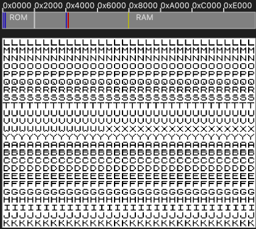
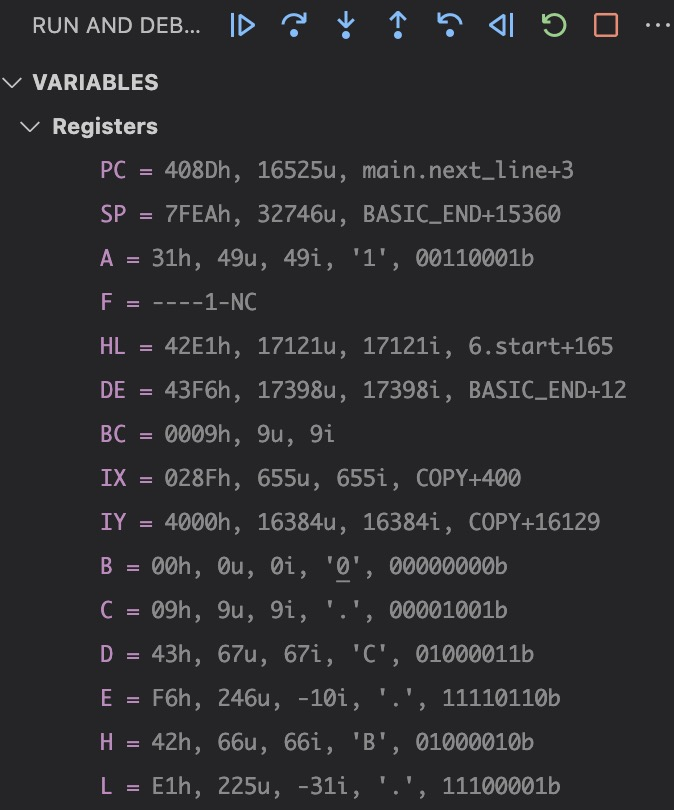
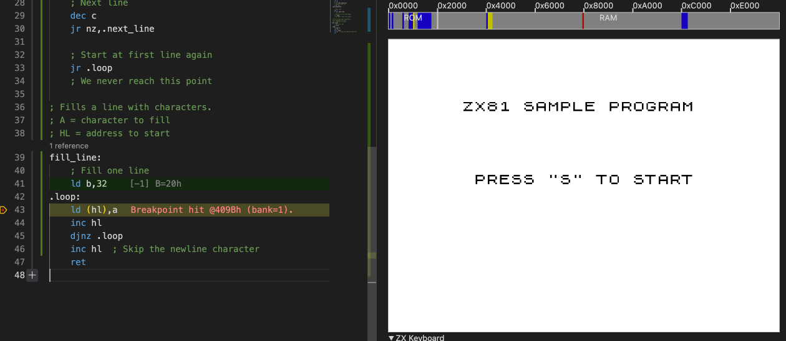

# Introduction
This is a small ZX81 assembler program to illustrate the debugging with [DeZog](https://github.com/maziac/DeZog).
The program consists of a BASIC loader (wrapper.asm) and and assembler program (main.asm).
The main.asm is wrapped into a REM statement at line 1 of the ZX BASIC program.

The BASIC program waits for the user to press "S" then it will start the machine code program.

The machine code program (main.asm) will just put characters on the screen:

# Prerequisites

- Visual Studio Code (vscode)
- [DeZog](https://github.com/maziac/DeZog) (>= v3.5.0)

In the current configuration the program runs in the internal Z80/ZX81 simulator.

If you want to build the Z80 binary yourself (not required if you just want to test debugging):
- Z80 Assembler: sjasmplus, https://github.com/z00m128/sjasmplus (known to work: v1.20.2).

# Building
First if you just want to test debugging with the 'DeZog' extension there is no need to build/assemble the required files.
The binaries are included in this repository so that you could also directly start to debug.

However, if you would like to do some changes you need to compile.
From the menu choose "Terminal->Run Build Task..."
tasks.json is configured such that it will call sjasmplus with the required parameters. (Please note that you probably have to adjust the path to sjasmplus.)

If you want to call sjasmplus manually you could use this command line:
~~~
sjasmplus --sld=zx81-program.sld --raw=zx81-program.p --fullpath "wrapper.asm"
~~~

There are several .asm files which are all included from the wrapper.asm file. This file is the one being assembled.

After the build is ready a zx81-program.p file is created which can be used with the internal simulator.
The p-file format allows execution also on other emulators.

## P-File creation
A .p file is just a memory copy of the ZX81 RAM data from 0x4009 onwards.
It contains the ZX81 system variables, the ZX81 BASIC program, the dfile (the screen) and the ZX81 BASIC variables.

The wrapper.asm contains the system variables and also constructs a few BASIC lines.
~~~
 1 REM ....
 10 IF INKEY$<>"S" THEN GOTO VAL "20"
 20 RAND USR VAL "16514"
~~~

The first line is a REM statement that will hold the machine code from main.asm.
Then there is a line to wait on input from the user, the BASIC program continues when "S" is pressed.
The last line jumps into the machine code in the REM statement, i.e. the code from the main.asm.

Note:
`VAL` is used to simplify the creation of the BASIC lines in assembler.
Without `VAL` the call to the machine code would look like
~~~
20 RAND USR 16514
~~~
The memory layout of the number consists of the number digits followed by a 5 byte floating point exponent and mantissa.
With using `VAL` we don't have to care about creating that floating point number. The ZX81 BASIC will do it for us.

# Running the Debugger with the Internal Z80 Simulator

The project comes with 2 configurations. One to start the zx81-program.p and one to boot the ZX81 without the program loaded.

Choose the zx81-program.p first:

Now start the debug session by pressing the green arrow.

The ZX81 simulator (zsim) is started and you should see the screen asking you to press "S".

When you press "S" the machine code is called and you see a screen that is being filled with characters.

Now switch to the editor with file "main.asm" and set a breakpoint.

DeZog will stop at the breakpoint.
Once DeZog is stopped you can e.g. examine the registers

From here you can:
- step into, step over, step-out
- hover over register in the asm file: It will show the values and also (if available) the corresponding labels.
- change register values: a double click on the value of a register in the REGISTER area will allow you to enter a different value.
- etc. See the [DeZog documentation](https://github.com/maziac/DeZog/blob/main/documentation/Usage.md) for more.

# "hires" or not
The ".vscode/launch.json" has a lot of options for the zsim simulator.
(Please see the ["zx81-zsim.md"](https://github.com/maziac/DeZog/blob/main/documentation/zx81-zsim.md) for more information.)

Among other options there is the "ulaOptions" with the "hires" property.
You can set it to "true" or "false".
If not set it defaults to "true".
In this mode zsim can display a lot of graphics. Developers invented a lot of tricks to get more out of the ZX81 standard graphics, allowing also high resolution graphics.
So this is the right setting if you want to develop such a game or are reverse-engineering a game that uses hires.

However, for developing standard graphics games (displaying charsets from the ZX ROM or RAM < 0x8000) setting "hires" to "false" is more helpful while debugging.
If "hires" is false the video output of zsim is not generated by the CPU.
The CPU is still serving all the interrupts and code to generate the video signal but zsim ignores the output and displays the dfile (screen) contents directly.

The advantage is that you can directly see any changes to the dfile on screen.
You don't have to wait until the CPU-video-signal-generation happens.

If "hires" is true you don't see any change to the screen until the video signal would be generated, i.e. this can be thousands of instructions later.

# Attribution
The wrapper software origins on software of [stevexyz](https://github.com/stevexyz) and Lardo.
